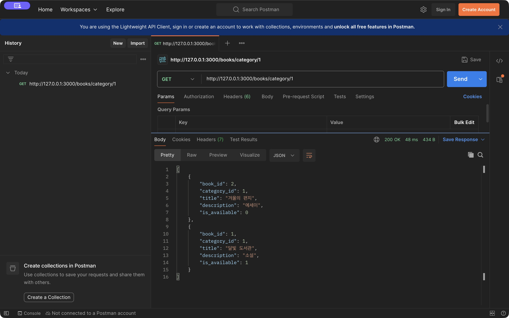
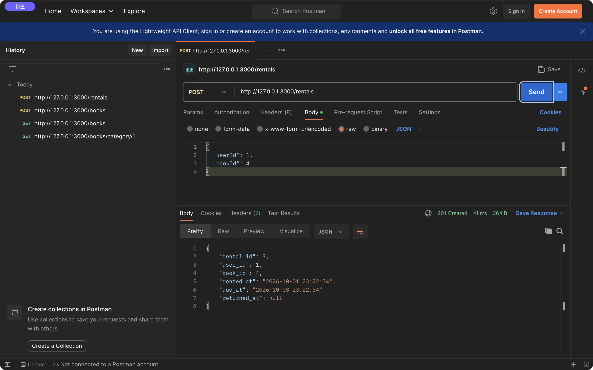
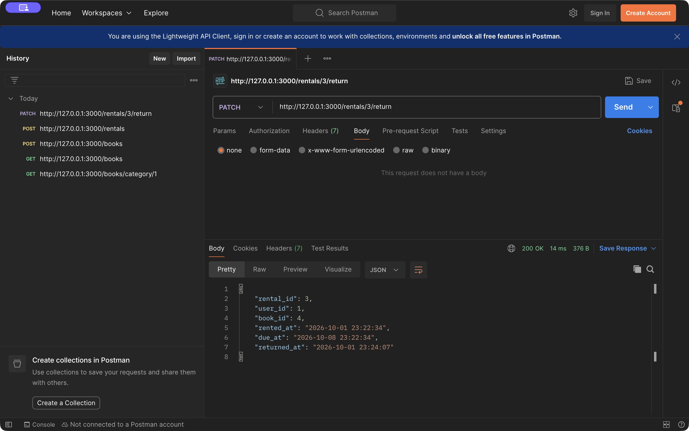
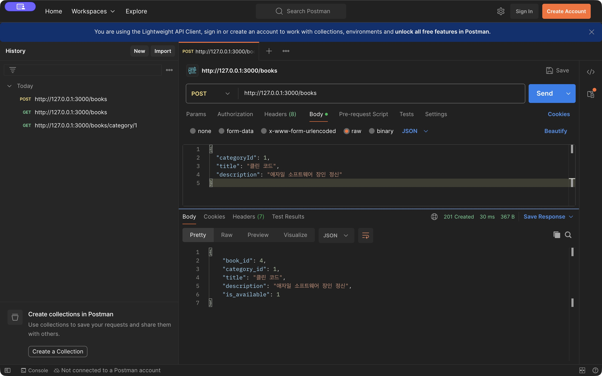
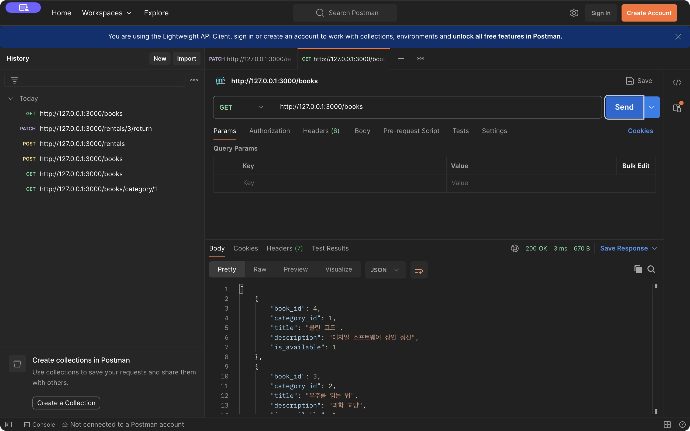

# 3주차 API 미션 기록

## 1. 구현 환경과 진행 과정

Node.js 과정의 **NestJS**를 선택하고 TypeScript, mysql2를 사용했다. 2주차 DB인 `umc_sql_week2`에 연결하고 DTO와 ORM 없이 Raw SQL로 구현했다.

진행 순서:

1. 기존 테이블 컬럼과 초기 데이터(책 3권, 대여 기록 2개)를 확인했다.
2. `.env`로 DB 접속 정보를 분리하고 MySQL 커넥션 풀을 등록했다.
3. Controller - Service - Repository 구조를 만들고 NestJS 모듈에 등록했다.
4. 기본 실습인 전체 도서 조회와 신규 도서 등록 API를 구현했다.
5. 필수 미션인 카테고리 도서 조회와 신규 대여 생성 API를 구현했다.
6. 선택 미션인 도서 반납 API를 구현했다.
7. 빌드와 DB 연결을 확인하고 Postman에서 실제 요청을 보냈다.
8. 성공 상태와 JSON 응답을 캡처하고 MySQL 저장 결과를 확인했다.

## 2. 3계층 구조

- **Controller**: HTTP 메서드, 경로 변수, JSON Body를 받아 Service에 전달한다.
- **Service**: 데이터 존재 여부, 대여 가능 여부, 중복 대여·반납을 판단하고 트랜잭션을 진행한다.
- **Repository**: `execute()`로 SELECT, INSERT, UPDATE 생 SQL을 실행한다.

도서와 대여를 각각 `books/`, `rentals/`로 분리했다. 쿼리와 비즈니스 로직의 역할을 나누고 생성자 주입으로 연결했다.

## 3. 필수 미션 1 - 카테고리 도서 목록 조회

**API: `GET /books/category/:categoryId`**

경로 변수 `categoryId`를 받고 `WHERE category_id = ?`로 해당 카테고리의 모든 도서를 조회한다. 값을 SQL 문자열에 직접 붙이지 않고 배열로 바인딩한다.

Controller:

```typescript
@Get('category/:categoryId')
findByCategory(@Param('categoryId') categoryId: string) {
  return this.service.findByCategory(pathId(categoryId, 'categoryId'));
}
```

Service:

```typescript
async findByCategory(categoryId: number) {
  if (!(await this.repository.categoryExists(categoryId))) {
    throw new NotFoundException('해당 카테고리를 찾을 수 없습니다.');
  }
  return this.repository.findByCategory(categoryId);
}
```

Repository:

```typescript
async findByCategory(categoryId: number): Promise<RowDataPacket[]> {
  const [rows] = await this.pool.execute<RowDataPacket[]>(
    'SELECT * FROM book WHERE category_id = ? ORDER BY book_id DESC',
    [categoryId],
  );
  return rows;
}
```

### 실제 실행 결과

- URL: `http://127.0.0.1:3000/books/category/1`
- 상태: **200 OK**
- 최초 요청에서 문학 카테고리의 `겨울의 편지`, `달빛 도서관`이 반환됐다.
- 과학 카테고리의 `우주를 읽는 법`은 포함되지 않았다.
- 대여 불가 도서도 해당 카테고리에 속하면 목록에 포함했다.



## 4. 필수 미션 2 - 신규 도서 대여 기록 생성

**API: `POST /rentals`**

JSON Body로 `userId`, `bookId`를 받는다. 대여 시각은 `NOW()`, 반납 기한은 `DATE_ADD(NOW(), INTERVAL 7 DAY)`, 최초 반납일은 `NULL`로 저장한다.

Controller:

```typescript
@Post()
@HttpCode(201)
create(@Body() body: Record<string, unknown>,
       @Headers('content-type') contentType: string | undefined) {
  jsonRequest(contentType);
  return this.service.create(body);
}
```

Repository:

```typescript
async create(connection: PoolConnection, userId: number, bookId: number) {
  const [result] = await connection.execute<ResultSetHeader>(`
    INSERT INTO rental (user_id, book_id, rented_at, due_at, returned_at)
    VALUES (?, ?, NOW(), DATE_ADD(NOW(), INTERVAL 7 DAY), NULL)
  `, [userId, bookId]);
  return result.insertId;
}
```

Service는 사용자·도서 존재 여부, 대여 가능 상태와 미반납 기록을 검사한다. 책 행을 `FOR UPDATE`로 잠그고 대여 기록 생성과 도서 상태 변경을 같은 트랜잭션에서 실행한다.

```typescript
const rentalId = await this.repository.create(connection, userId, bookId);
await this.repository.setBookAvailability(connection, bookId, false);
return this.repository.findById(rentalId, connection);
```

### 실제 요청

```http
POST http://127.0.0.1:3000/rentals
Content-Type: application/json
```

```json
{
  "userId": 1,
  "bookId": 4
}
```

기본 실습에서 새로 등록한 `클린 코드`(`book_id = 4`)를 대여했다.

### 실제 응답: 201 Created

```json
{
  "rental_id": 3,
  "user_id": 1,
  "book_id": 4,
  "rented_at": "2026-10-01 23:22:34",
  "due_at": "2026-10-08 23:22:34",
  "returned_at": null
}
```



## 5. 선택 미션 - 도서 반납 처리

**API: `PATCH /rentals/:rentalId/return`**

대여 생성 응답의 `rental_id`를 경로 변수로 전달한다. 해당 대여 기록의 `returned_at`을 `NOW()`로 갱신한다.

Controller:

```typescript
@Patch(':rentalId/return')
@HttpCode(200)
returnBook(@Param('rentalId') rentalId: string) {
  return this.service.returnBook(pathId(rentalId, 'rentalId'));
}
```

Repository:

```typescript
async markReturned(connection: PoolConnection, rentalId: number) {
  await connection.execute(
    'UPDATE rental SET returned_at = NOW() WHERE rental_id = ?',
    [rentalId],
  );
}
```

Service에서 없는 기록과 이미 반납한 기록을 구분한다. 반납 시각과 도서 상태 갱신도 같은 트랜잭션에 묶었다. 다른 미반납 기록이 없으면 다시 대여 가능하게 변경한다.

### 실제 요청

```http
PATCH http://127.0.0.1:3000/rentals/3/return
```

Request Body는 `none`으로 설정했다.

### 실제 응답: 200 OK

```json
{
  "rental_id": 3,
  "user_id": 1,
  "book_id": 4,
  "rented_at": "2026-10-01 23:22:34",
  "due_at": "2026-10-08 23:22:34",
  "returned_at": "2026-10-01 23:24:07"
}
```



## 6. 기본 실습 및 DB 결과

`GET /books`로 기존 책 3권을 조회하고 `POST /books`로 아래 도서를 등록했다.

```json
{
  "categoryId": 1,
  "title": "클린 코드",
  "description": "애자일 소프트웨어 장인 정신"
}
```

- 등록 응답은 **201 Created**, 생성된 책 ID는 `4`였다.
- 다시 `GET /books`로 새 책이 목록에 추가된 것을 확인했다.
- 반납까지 완료한 뒤 책 개수는 `3 → 4`, 대여 기록은 `2 → 3`이었다.
- MySQL의 `TIMESTAMPDIFF(SECOND, rented_at, due_at)` 결과는 `604800초`, 즉 정확히 **7일**이었다.
- 반납일이 저장됐으며 도서의 `is_available = 1`을 확인했다.





## 7. 트러블슈팅

### 이슈 1: 최초 구현의 프레임워크와 구조가 워크북 조건과 맞지 않음

- **이슈**: 미션 이미지만 기준으로 작성한 초기 버전은 Express였고 SQL이 Service에 들어 있었다.
- **문제**: PDF 원문에서는 NestJS와 Controller - Service - Repository 분리를 요구했다.
- **해결**: NestJS로 변경하고 도서·대여별 Controller, Service, Repository를 분리했다. 기본 실습 API도 추가하고 DB 행을 그대로 반환하도록 맞췄다.

### 이슈 2: 최초 로컬 DB 접속 시 EPERM 발생

- **이슈**: 첫 서버 실행 환경에서 MySQL TCP 접속에 `EPERM` 오류가 발생했다.
- **문제**: 실행 환경의 로컬 네트워크 접근 제한으로 DB 연결이 차단됐다.
- **해결**: 로컬 접속이 허용된 실행 환경에서 다시 시작했다. MySQL 연결 로그와 실제 Postman 요청으로 정상 연결을 확인했다.

## 8. 정리

Raw SQL의 `?` 바인딩으로 요청 값을 전달하고 3계층의 역할을 분리했다. DTO 없이 원래 JSON 객체를 받으므로 필수 값과 타입은 런타임에 직접 검사했다.

필수 미션 2개·선택 미션 1개와 기본 실습 2개를 구현하고 Postman 성공 흐름, 등록 후 재조회, 실제 DB 저장 결과를 확인했다. 오류 분기·동시 요청·롤백에 대한 별도 자동 테스트는 수행하지 않았다.

노션에는 이 기록과 핵심 코드, `docs/evidence/`의 실제 JPG를 각 위치에 첨부한다. Markdown의 상대 경로 이미지는 GitHub에서 표시된다.

기록의 시각은 2026-10-01 한국 시간 기준이다. 대여 3번은 반납 완료 상태이므로 다시 실습할 때는 새 POST 응답의 `rental_id`를 사용한다.
