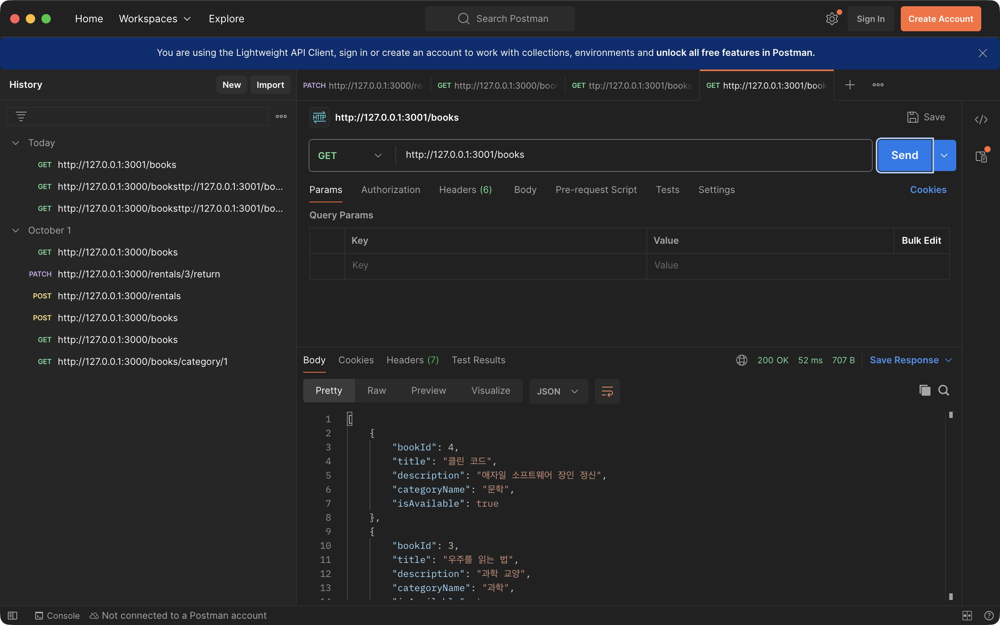
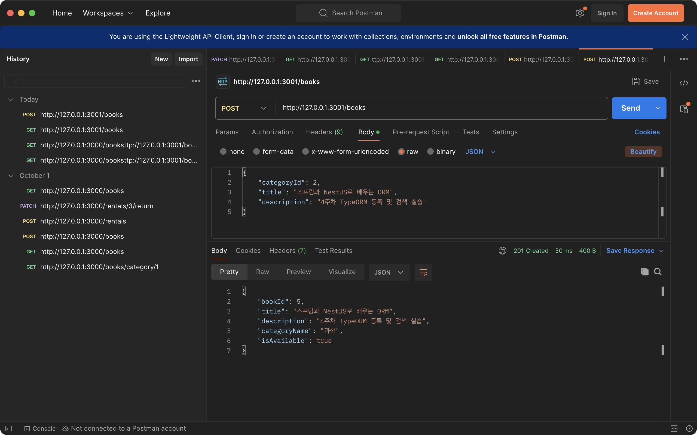
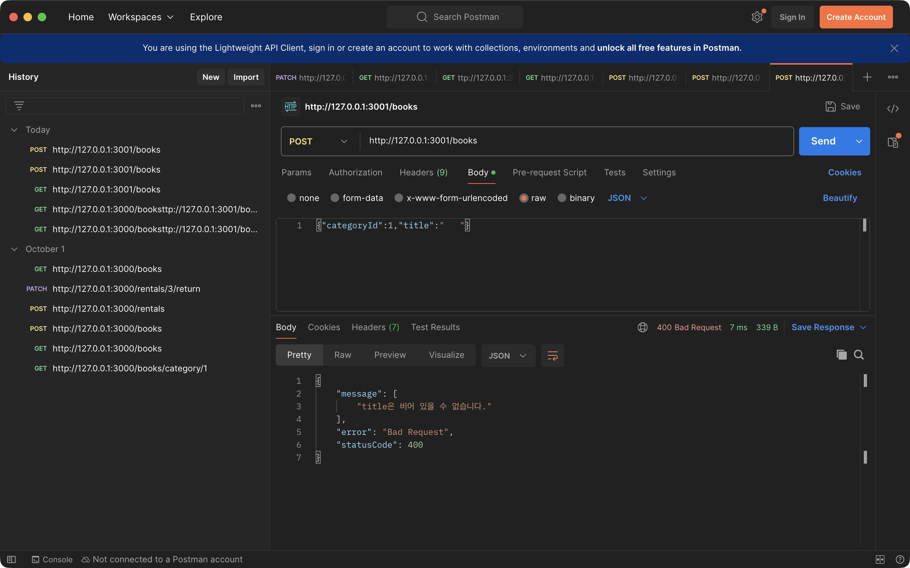
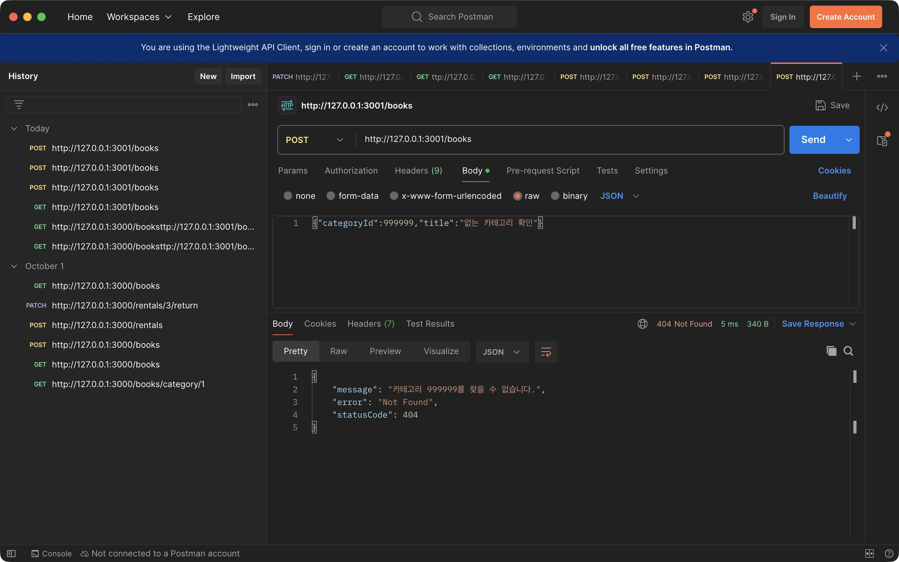
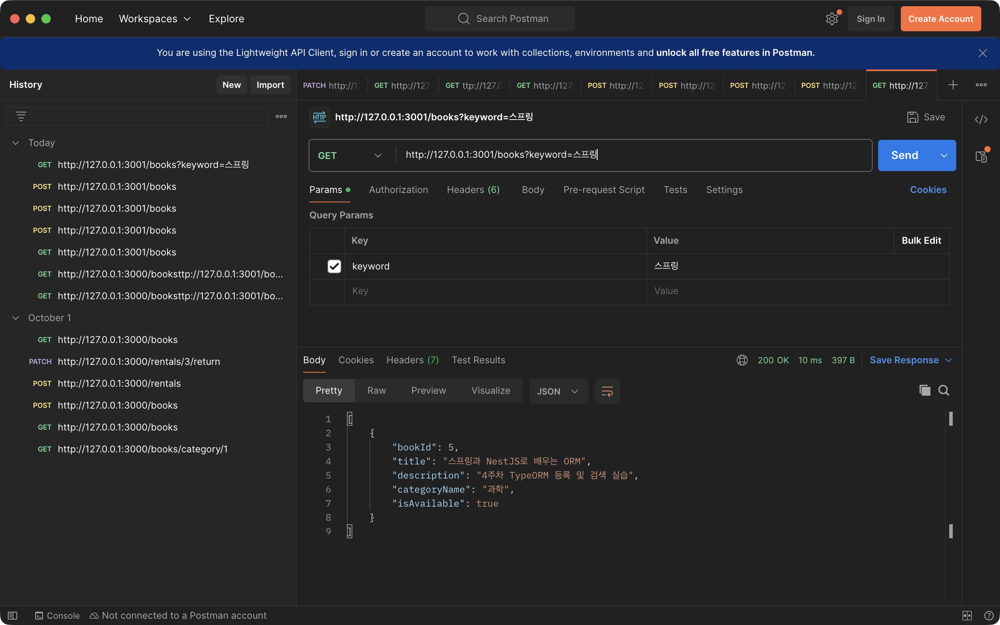
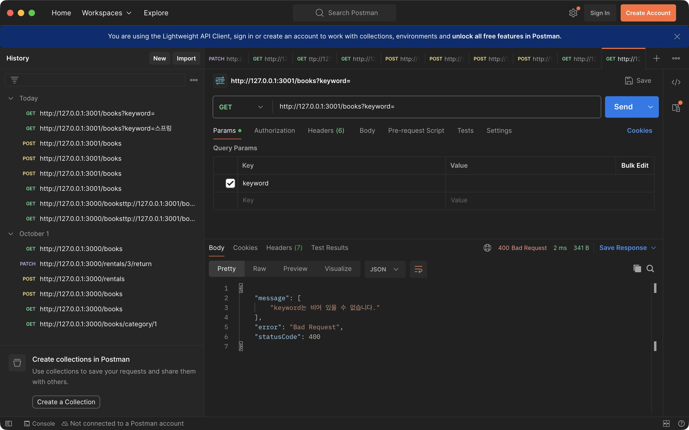
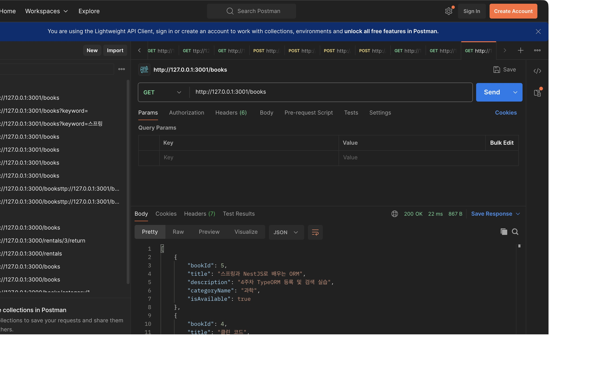

# 4주차 미션 기록 — ORM으로 생산성 높이고 첫 API 완성하기

제출 코드: [백엔드 PR #7](https://github.com/SSUMC-11th-organization/PE_Web_C_BE/pull/7) · [관련 이슈 #6](https://github.com/SSUMC-11th-organization/PE_Web_C_BE/issues/6).

## 1. 목표와 구현 범위

3주차의 Raw SQL 도서 API를 Node.js의 NestJS와 TypeORM으로 리팩터링했다. 기존 MySQL `book`, `category` 테이블과 데이터를 사용하고, 3주차 원본은 별도 프로젝트와 [3주차 PR #2](https://github.com/SSUMC-11th-organization/PE_Web_C_BE/pull/2)에 보존했다.

- **필수:** Book·Category Entity와 다대일 관계, GET `/books`, POST `/books`, 요청 DTO 검증, 존재하지 않는 카테고리 예외 처리.
- **선택 1:** 카테고리 이름을 함께 조회하고 Response DTO로 반환.
- **선택 2:** GET `/books?keyword=스프링` 제목 부분 검색.
- 선택 3인 제목 UNIQUE 제약과 중복 등록 방지는 이번 구현 범위에 포함하지 않았다.

## 2. 진행 과정

1. 과제 PDF에서 엔티티·DTO·Repository·Service·Controller 구성, 201/400/404 응답, Postman 인증과 비교 기록 조건을 확인했다.
2. 3주차 프로젝트와 기존 MySQL 스키마를 읽어 `book_id`, `category_id`가 BIGINT이고 `is_available`이 boolean 계열 컬럼임을 확인했다. 기존 데이터는 카테고리 2개와 도서 4권이었다.
3. 원본을 보존하기 위해 `dominic/Week4/Week4_Mission`에 별도 NestJS 프로젝트를 만들었다. NestJS 11에 맞는 `@nestjs/typeorm` 11.0.3과 TypeORM 0.3.31을 사용했다.
4. Book·Category Entity에 테이블명, snake_case 컬럼명, 타입과 길이를 명시하고 `ManyToOne`·`OneToMany`, `JoinColumn`으로 관계를 연결했다.
5. `TypeOrmModule.forRootAsync()`로 환경변수 기반 DB 연결을 구성했다. `synchronize: false`를 사용해 기존 스키마를 자동 변경하지 않도록 했다.
6. `TypeOrmModule.forFeature([Book, Category])`와 `@InjectRepository()`를 사용해 Repository를 주입했다. 도서 목록은 `find()`, 카테고리는 `findOneBy()`, 등록은 `create()`·`save()`로 처리했다.
7. 요청 DTO와 글로벌 `ValidationPipe`를 적용했다. 제목은 trim 후 빈 값과 100자 초과를 거부하고, categoryId는 양의 안전한 정수로 검증한다. 설명은 생략 또는 null을 허용하며 TEXT 저장 한도에 맞춰 UTF-8 바이트 길이를 제한했다.
8. Service에서 카테고리 존재 여부를 확인하고, 없으면 `NotFoundException`을 던지도록 했다. 응답은 Entity 전체 대신 정확히 5개 필드를 가진 DTO로 변환했다.
9. 도서 목록에 카테고리를 JOIN으로 함께 조회하고 `bookId DESC`로 정렬했다. 제목 검색에는 TypeORM `Like()`를 사용했으며 `%`, `_`, `\`는 검색어의 문자로 취급하도록 이스케이프했다.
10. 빌드를 완료한 뒤 3001 포트에서 실행했다. Postman에서 필수·선택 정상 요청과 오류 요청을 확인하고 캡처를 저장했다. MySQL에서도 신규 도서가 실제 저장되어 전체 5권이 되었음을 확인했다.

## 3. 핵심 구현

| 구성 | 역할 | 코드 |
| --- | --- | --- |
| Entity | 기존 book/category 테이블·컬럼과 다대일 관계 매핑 | [Book](https://github.com/SSUMC-11th-organization/PE_Web_C_BE/blob/aa92d6b76a3bd8b411acba09085c547b2450215f/dominic/Week4/Week4_Mission/src/books/book.entity.ts), [Category](https://github.com/SSUMC-11th-organization/PE_Web_C_BE/blob/aa92d6b76a3bd8b411acba09085c547b2450215f/dominic/Week4/Week4_Mission/src/categories/category.entity.ts) |
| 요청 DTO | categoryId·title·description과 검색어 검증 | [CreateBookDto](https://github.com/SSUMC-11th-organization/PE_Web_C_BE/blob/aa92d6b76a3bd8b411acba09085c547b2450215f/dominic/Week4/Week4_Mission/src/books/dto/create-book.dto.ts), [FindBooksQueryDto](https://github.com/SSUMC-11th-organization/PE_Web_C_BE/blob/aa92d6b76a3bd8b411acba09085c547b2450215f/dominic/Week4/Week4_Mission/src/books/dto/find-books-query.dto.ts) |
| 응답 DTO | bookId, title, description, categoryName, isAvailable만 반환 | [BookResponseDto](https://github.com/SSUMC-11th-organization/PE_Web_C_BE/blob/aa92d6b76a3bd8b411acba09085c547b2450215f/dominic/Week4/Week4_Mission/src/books/dto/book-response.dto.ts) |
| Repository | ORM을 통한 관계 조회·정렬·검색·등록 | [BookRepository](https://github.com/SSUMC-11th-organization/PE_Web_C_BE/blob/aa92d6b76a3bd8b411acba09085c547b2450215f/dominic/Week4/Week4_Mission/src/books/book.repository.ts), [CategoryRepository](https://github.com/SSUMC-11th-organization/PE_Web_C_BE/blob/aa92d6b76a3bd8b411acba09085c547b2450215f/dominic/Week4/Week4_Mission/src/categories/category.repository.ts) |
| Service | 카테고리 존재 확인과 응답 DTO 변환 | [BooksService](https://github.com/SSUMC-11th-organization/PE_Web_C_BE/blob/aa92d6b76a3bd8b411acba09085c547b2450215f/dominic/Week4/Week4_Mission/src/books/books.service.ts) |
| Controller | GET/POST 경로와 DTO를 연결하고 POST 201 지정 | [BooksController](https://github.com/SSUMC-11th-organization/PE_Web_C_BE/blob/aa92d6b76a3bd8b411acba09085c547b2450215f/dominic/Week4/Week4_Mission/src/books/books.controller.ts) |
| 설정 | 환경변수 DB 연결, forFeature, 글로벌 ValidationPipe | [AppModule](https://github.com/SSUMC-11th-organization/PE_Web_C_BE/blob/aa92d6b76a3bd8b411acba09085c547b2450215f/dominic/Week4/Week4_Mission/src/app.module.ts), [BooksModule](https://github.com/SSUMC-11th-organization/PE_Web_C_BE/blob/aa92d6b76a3bd8b411acba09085c547b2450215f/dominic/Week4/Week4_Mission/src/books/books.module.ts), [main](https://github.com/SSUMC-11th-organization/PE_Web_C_BE/blob/aa92d6b76a3bd8b411acba09085c547b2450215f/dominic/Week4/Week4_Mission/src/main.ts) |

### Entity 관계

`Category 1 : N Book` 관계다. Book의 `category_id`가 외래키이며 Book Entity의 `ManyToOne`과 `JoinColumn`이 이 컬럼에 연결된다. 카테고리 이름을 출력할 때 도서마다 추가 조회하는 대신 필요한 관계를 함께 가져온다.

### API 계약

성공 응답은 다음 형식을 사용한다. GET은 배열, POST는 등록한 도서 한 개를 반환한다.

```json
{
  "bookId": 5,
  "title": "스프링과 NestJS로 배우는 ORM",
  "description": "4주차 TypeORM 등록 및 검색 실습",
  "categoryName": "과학",
  "isAvailable": true
}
```

DB에서는 snake_case를 사용하고, API에서는 camelCase를 사용한다. BIGINT ID는 내부에서 문자열로 보존한 뒤 안전한 정수 범위에서 응답의 number로 변환한다.

## 4. 실제 실행 결과

확인일: 2026-10-08. [상세 요청·응답 기록](docs/VERIFICATION.md).

| 구분 | 요청 | 확인한 결과 |
| --- | --- | --- |
| 필수 조회 | GET `/books` | 200, 최신 ID 순서·카테고리 이름·대여 가능 여부 반환 |
| 필수 등록 | POST `/books` | 201, 신규 bookId 5 생성 |
| 필수 입력 오류 | title에 공백만 전달 | 400, 빈 제목 안내 |
| 필수 업무 오류 | categoryId 999999 전달 | 404, 카테고리 없음 안내 |
| 선택 제목 검색 | GET `/books?keyword=스프링` | 200, 등록한 도서 1권 조회 |
| 선택 검색 오류 | GET `/books?keyword=` | 400, 빈 검색어 안내 |

### 전체 조회



### 신규 등록



### 빈 제목과 없는 카테고리





### 선택 미션 제목 검색





### 등록 후 목록 확인



POST 뒤 DB에는 기존 도서 4권과 새 도서 1권이 존재했다. 기존 대여 불가 도서 `겨울의 편지`도 유지되었으며, 전체 조회는 대여 가능 여부로 필터링하지 않는다.

## 5. 3주차 Raw SQL과 비교한 변경점

3주차에는 직접 작성한 SELECT·INSERT SQL과 mysql2로 데이터베이스를 조회하고 저장했지만, 4주차에는 Entity와 TypeORM Repository의 `find()`, `create()`, `save()`로 같은 도서 조회·등록 기능을 표현했다.

기존에는 JOIN 조건과 DB 컬럼 이름을 SQL 문자열 안에 적었지만, 이번에는 Entity에서 도서와 카테고리 관계를 선언하고 필요한 관계를 조회 옵션에 지정했다.

3주차의 입력 검사 코드를 DTO 검증 데코레이터와 글로벌 ValidationPipe로 옮겨 요청 형식을 API 경계에서 검사하고, 카테고리 존재 여부 같은 업무 조건은 Service에서 처리했다.

응답은 DB 조회 결과를 그대로 전달하는 대신 Response DTO로 변환하여 camelCase 필드 이름과 boolean 타입을 유지하고 Category 객체 전체를 노출하지 않도록 했다.

ORM이 SQL 작성을 줄여 주더라도 기존 스키마의 타입, SQL 실행 방식과 관계 조회 성능을 이해해야 하므로 컬럼 매핑과 JOIN 조회 방식은 직접 확인했다.

## 6. 구현 중 확인한 사항과 해결

- **버전 호환성:** 최신 NestJS ORM 통합 패키지의 메이저 버전이 기존 NestJS 11과 달라, NestJS 11용 통합 패키지를 선택하고 설치 버전을 고정했다.
- **BIGINT와 boolean:** 기존 테이블의 BIGINT를 내부 문자열로 보존하고 응답에서 안전한 number로 변환했다. 대여 가능 여부는 boolean 컬럼 매핑으로 true/false를 반환했다.
- **공백 제목:** 문자열 trim만으로는 검증이 끝나지 않으므로 trim 이후 `IsNotEmpty`를 적용했다. 실제 공백 제목 요청에서 400을 확인했다.
- **Postman 주소:** 처음 기존 3000 포트 요청과 새 주소가 겹쳐 연결 오류가 발생했다. 정확한 3001 포트 URL을 cURL 가져오기로 입력한 뒤 실제 200·201·400·404 응답을 확인했다.
- **설명 길이:** 수동 코드 검토에서 TEXT의 바이트 한도를 넘는 설명이 저장 단계에서 실패할 수 있음을 확인해 DTO에 65,535바이트 제한을 추가했다. 해당 경계값의 별도 Postman 인증은 이번 캡처에 포함하지 않았다.

## 7. 검증 문장

실제 Postman 실행에서 전체 도서 조회 200, 신규 등록 201, 빈 제목 400, 없는 카테고리 404, 제목 검색 200과 빈 검색어 400을 확인하여 필수 미션 및 선택한 두 기능이 요구사항에 맞게 동작함을 확인했다.

## 8. 제출 자료

- 핵심 코드: 위 Entity·DTO·Repository·Service·Controller 링크.
- 실제 Postman 캡처: `docs/evidence/`.
- 핵심 키워드 정리: [KEYWORDS.md](docs/KEYWORDS.md).
- 재사용 요청: [requests.http](requests.http), [Postman Collection](docs/week4.postman_collection.json).
- 개인 Notion의 미션 기록에 본문을 복사하고 캡처를 첨부한 뒤, 과제 제출 사이트에 개인 Notion 페이지 URL을 제출한다.
- GitHub 코드 링크는 그대로 사용할 수 있다. 문서의 이미지는 `docs/evidence/`의 JPG 7개를 Notion에 함께 첨부한다.
